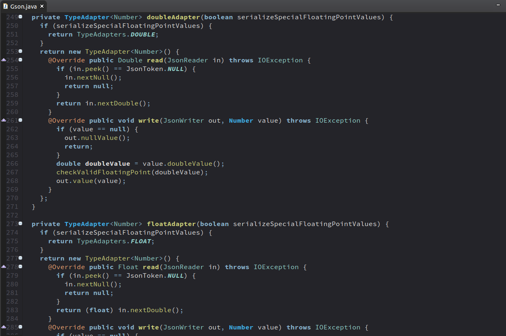

Northem Dark - Eclipse Syntax
=============================

### Description
A north-bluish dark theme based on the same named color palette [Northem Dark](https://github.com/arcticicestudio/northem-dark).  
This is a darker and more blue-tinged variation of the [Northem](https://github.com/arcticicestudio/northem) color palette.

### Variations
  - <a href="https://github.com/arcticicestudio/northem-eclipse-syntax"> Northem - Eclipse Syntax</a>   
  - <a href="https://github.com/arcticicestudio/northem-light-eclipse-syntax"> Northem Light Eclipse Syntax</a>   

### Other Projects
  - <a href="https://github.com/arcticicestudio/northem-dark-atom-syntax"> Northem Atom Syntax</a>   
  - <a href="https://github.com/arcticicestudio/northem-dark-intellij-idea-syntax"> Northem Dark - IntelliJ IDEA Syntax</a>   
  -  <a href="https://github.com/arcticicestudio/northem-dark-gedit-syntax"> Northem Dark - Gedit Syntax</a> 
  - <a href="#"> Northem Dark - GTK</a> (in drafting) 
  - <a href="https://github.com/arcticicestudio/northem-dark-notepadplusplus-syntax"> Northem Dark - Notepad++ Syntax</a> 

Visit the [official website](http://arcticicestudio.com/northem) (currently under construction) for more information.

### Languages / Syntax Highlighting / Editors
  -  <a href="http://www.adobe.com/devnet/actionscript.html">ActionScript</a>
  [`com.adobe.flexide.as.core@4.0.0`](http://eclipsecolorthemes.org/?view=empty&action=mapping&plugin=com.adobe.flexide.as.core)
  -  <a href="http://ant.apache.org/">Apache Ant</a>
  [`org.eclipse.ant.ui@3.5.0`](http://eclipsecolorthemes.org/?view=empty&action=mapping&plugin=org.eclipse.ant.ui)
  -  <a href="https://isocpp.org/">C++</a>
  [`org.eclipse.cdt.ui@7.0.1`](http://eclipsecolorthemes.org/?view=empty&action=mapping&plugin=org.eclipse.cdt.ui)
  -  <a href="https://www.w3.org/TR/CSS/">CSS</a>
  [`org.eclipse.wst.css.ui@1.0.502`](http://eclipsecolorthemes.org/?view=empty&action=mapping&plugin=org.eclipse.wst.css.ui)
  -  <a href="http://www.groovy-lang.org/">Groovy</a>
  [`org.codehaus.groovy.eclipse.ui@*.*.*`](http://eclipsecolorthemes.org/?view=empty&action=mapping&plugin=org.codehaus.groovy.eclipse.ui)
  -  <a href="https://www.w3.org/html/">HTML</a>
  [`org.eclipse.wst.html.ui@1.0.502`](http://eclipsecolorthemes.org/?view=empty&action=mapping&plugin=org.eclipse.wst.html.ui)
  -  <a href="http://www.oracle.com/technetwork/java/javase/overview/index.html">Java</a>
  [`org.eclipse.jdt.ui@3.6.1`](http://eclipsecolorthemes.org/?view=empty&action=mapping&plugin=org.eclipse.jdt.ui)
  -  <a href="http://www.ecmascript.org/">JavaScript</a>
  [`org.eclipse.wst.jsdt.ui@1.0.502`](http://eclipsecolorthemes.org/?view=empty&action=mapping&plugin=org.eclipse.wst.jsdt.ui)
  -  <a href="http://www.oracle.com/technetwork/java/jsp-138432.html">JSP</a>
  [`org.eclipse.jst.jsp.ui@*.*.*`](http://eclipsecolorthemes.org/?view=empty&action=mapping&plugin=org.eclipse.jst.jsp.ui)
  -  <a href="https://www.perl.org/">Perl</a>
  [`org.epic.perleditor@0.5.46`](http://eclipsecolorthemes.org/?view=empty&action=mapping&plugin=org.epic.perleditor)
  -  <a href="https://php.net/">PHP</a>
  [`org.eclipse.php.ui@2.2.1`](http://eclipsecolorthemes.org/?view=empty&action=mapping&plugin=org.eclipse.php.ui)
  -  <a href="https://www.python.org/">Python</a>
  [`org.python.pydev@1.6.4`](http://eclipsecolorthemes.org/?view=empty&action=mapping&plugin=org.python.pydev)
  -  <a href="http://www.scala-lang.org/">SCALA</a>
  [`org.scala-ide.scala@2.0.0`](http://eclipsecolorthemes.org/?view=empty&action=mapping&plugin=org.scala-ide.scala)
  -  <a href="http://www.iso.org/iso/iso_catalogue/catalogue_tc/catalogue_detail.htm?csnumber=53681">SQL</a>
  [`org.eclipse.datatools.sqltools.sqleditor@1.8.1`](http://eclipsecolorthemes.org/?view=empty&action=mapping&plugin=org.eclipse.datatools.sqltools.sqleditor)
  -  <a href="https://www.w3.org/TR/2006/REC-xml11-20060816/">XML</a>
  [`org.eclipse.wst.xml.ui@1.0.502`](http://eclipsecolorthemes.org/?view=empty&action=mapping&plugin=org.eclipse.wst.xml.ui)

### Version
[`0.0.0`](https://github.com/arcticicestudio/northem-dark-eclipse-syntax/releases/latest)  

For older versions check out the [GitHub Repository](https://github.com/arcticicestudio/northem-dark-eclipse-syntax) or [official website](http://arcticicestudio.com/northem) (currently under construction).

### Changelog
[`0.0.0`](CHANGELOG.md)

### Installation
Install the required plugin and recommended font, read the [Dependencies](#Dependencies)- and [Recommendations](#Recommendations) sections for more information.

Go to *Window* > *Preferences*, browse to *General* > *Appearance* > *Color Theme* and click on *Import* a *theme*.  
Alternatively you can install it without the plugin by going to *File* > *Import*, select *General* > *Preferences* and import the `northem-dark-eclipse-syntax.epf` file.

Activate it by going to *Window* > *Preferences*, browse to *General* > *Appearance* > *Color Theme* and select `Northem Dark` from the list.

### Development
#### Workflow
This project follows the [gitflow](http://nvie.com/posts/a-successful-git-branching-model) branching model.

#### Specifications
This project follows the [Arctic Versioning Specification (ArcVer)](https://github.com/arcticicestudio/arcver).

### Dependencies
This theme requires the plugin [Eclipse Color Theme](http://eclipsecolorthemes.org/plugin) ([Update Site](http://eclipse-color-theme.github.io/update)) when not installed via the preferences file import.

#### Production
**Engines**
  - [`eclipse@4.5.*`](https://eclipse.org)

#### Development
  - [`northem-dark@1.0.1`](https://github.com/arcticicestudio/northem-dark)

**Engines**
  - [`git@2.8.*`](https://git-scm.com)

**Skeletons**
  - [`glacier-git@0.23.0`](https://github.com/arcticicestudio/glacier-git)

### Recommendations
This theme matches the Open Source font [Source Code Pro](https://typekit.com/fonts/source-code-pro).  
Visit the [GitHub Repository](https://github.com/adobe-fonts/source-code-pro) for more information.

### Contribution
Please report issues/bugs, suggestions for improvements and feature requests to the [issuetracker](https://github.com/arcticicestudio/northem-dark-eclipse-syntax/issues).

### Author
[Northem Dark - Eclipse Syntax](https://github.com/arcticicestudio/northem-dark-eclipse-syntax) is developed and authored by [Arctic Ice Studio](http://arcticicestudio.com).

### Copyright
<a href="mailto:development@arcticicestudio.com"> Copyright &copy; 2015-2016 Arctic Ice Studio</a>

### License
 

### Credits
[Felix H. Dahlke](https://twitter.com/fhd) & [Roger Dudler](https://twitter.com/rogerdudler) for their awesome plugin and theme collection website.

---

### References
  - [Northem Dark](http://github.com/arcticicestudio/northem-dark)
  - [Eclipse Color Themes](http://eclipsecolorthemes.org)  
  - [Eclipse Documentation](http://www.eclipse.org/documentation)  
  - [Eclipse Theme API](help.eclipse.org/luna/index.jsp?topic=/org.eclipse.platform.doc.isv/reference/extension-points/org_eclipse_ui_themes.html)
  - [Arctic Versioning Specification](http://specs.arcticicestudio.com/arcver) (ArcVer)
  - [gitflow](http://nvie.com/posts/a-successful-git-branching-model)
  - [Glacier - Git](https://github.com/arcticicestudio/glacier-git)
